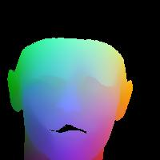
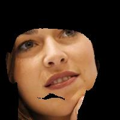
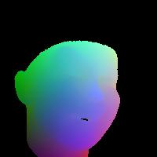
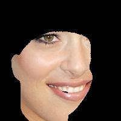

### Re-implementation Work

The matlab codes in the folder `MakeTrainData` are used for generating training data from [VGGFace](http://www.robots.ox.ac.uk/~vgg/data/vgg_face/).
To download the images from VGGFace, you can use the download_vggface.py:
```
python download_vggface.py ./vgg_face_dataset/files
```

Samples of current data preparation results are structured as the folder `./samples`:







The 235-dimensional param vecters are saved in the `labels` folder.
7-dim for pose parameters ([phi; gamma; theta; t3d_x; t3d_y; t3d_z; focal_factor];)
199-dim for shape parameters
29-dim for expression parameters

#### To be continued...