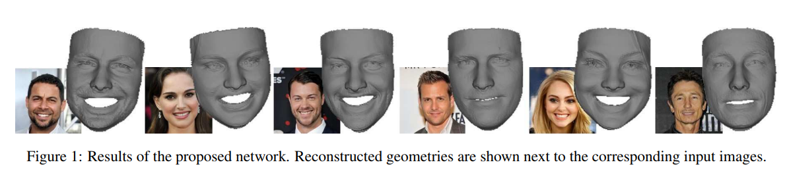
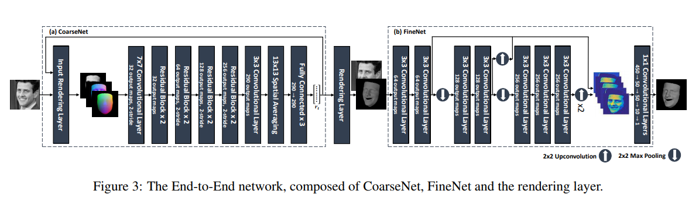

## Re-implementation Work of 3D Face Reconstruction

This repo is the re-implementation work of the paper [Learning Detailed Face Reconstruction from a Single Image (CVPR2017)](http://openaccess.thecvf.com/content_cvpr_2017/papers/Richardson_Learning_Detailed_Face_CVPR_2017_paper.pdf).

**Note**: Currently, this repo has not been well improved to completely get exactly the same results of the paper.




### Requirement

> * python == 3.5.x (with opencv-python, scipy, etc. Anaconda==3.4.x is recommended.)
> * TensorFlow == 1.2.0 (with CUDA8.0 and cudnn5.1).
> * gcc == 4.8.x (for compiling rendering layer).
> * Data preparation on Windows and implementation codes support only the Linux platform currently.


### Data Preparation

1. Download the images URL files from [VGGFace](http://www.robots.ox.ac.uk/~vgg/data/vgg_face/). Then extract them into the `./data` folder.      

    To download all the images of VGGFace, you can use the `download_vggface.py` in the folder `./data`:
	```shell
	cd ./data
	python download_vggface.py ./vgg_face_dataset/files  # This process may take long time.
	```

2. Compile the Zbuffer Lib within the folder `./prepare_data/ZBuffer` by running the script: `compile.m`

    Note that you can also ignore this step with Windows platform.

3. Prepare 3DMM facial model.    

    You should firstly download the basic BFM model from [3DDFA](http://www.cbsr.ia.ac.cn/users/xiangyuzhu/projects/3DDFA/main.htm), where the following `.mat` files are needed in the `./3dmm` folder:    
	```shell
	01_MorphableModel.mat
	Model_Expression.mat
	model_info.mat
	vertex_code.mat
	```

    You can also download them from [Baidu Cloud](https://pan.baidu.com/s/1S_mJMFUxc_9FSw4eMGdVKw) or [Google Drive](https://drive.google.com/drive/folders/1b0m7W9SwwZyHqk4XnzEFjdvvsvJbL_TO?usp=sharing).    

    Then, run the MATLAB script `./prepare_data/script_ModelGenerate.m` to generate `Model_Shape.mat` file in the `./3dmm` folder.

4. Ground truth generation. The matlab codes `./prepare_data/script_generate_dataset.m` are used for generating training data. You should modify the input and output directories accordingly. As a result, facial images and text labels should be placed in folder `./data/vggface`.    

    Only the cropped facial images and text labels are used in this project. The 235-dimensional param vecters are saved in the `labels` folder.    
> * dim 1-7: pose parameters ([phi; gamma; theta; t3d_x; t3d_y; t3d_z; f];)    
> * dim 7+1 --> 7+199: shape parameters.    
> * dim 7+199+1 --> 7+199+29: expression parameters.    

5. Prepare training dataset. Just run the following python scripts

	```shell
	# split training dataset into train val and test splits.
	cd ./prepare_data
	python script_split_dataset.py
	# compute the mean value for training.
	python script_compute_mean.py

	```

### Installation

1. Compiling the custom op with tensorflow.    
	```shell
	cd ./rendering_layer
	sh ./compile.sh
	cd ..

	```
    Make sure no errors happened in this compiling process and the file `render_depth.so` is generated under the folder `./rendering_layer/ops_src/`

2. Simple Test. You can use the provided python script `sample_test.py` to test the `render_depth.so`.   
	```shell
	cd ./rendering_layer
	python sample_test.py
	cd ..
	```

### Train and Test

1. Just run the shell script `./run_experiment.sh` directly, or you can modify several input args before running.

    To visualize the training process, you can use the tensorboard tool:  
	
	```shell
	cd ./output/tensorboard
	tensorboard --logdir=./ --port=6710
	```

### Citation
If you find this implementation or the analysis conducted in our report helpful, please consider citing:

    @article{Richardson_CVPR2017,
        Author = {E. Richardson and M. Sela and R. Or-El and R. Kimmel},
        Title = {Learning Detailed Face Reconstruction from a Single Image},
        booktitle={2017 IEEE Conference on Computer Vision and Pattern Recognition (CVPR)},
        Year = {2017}
    }